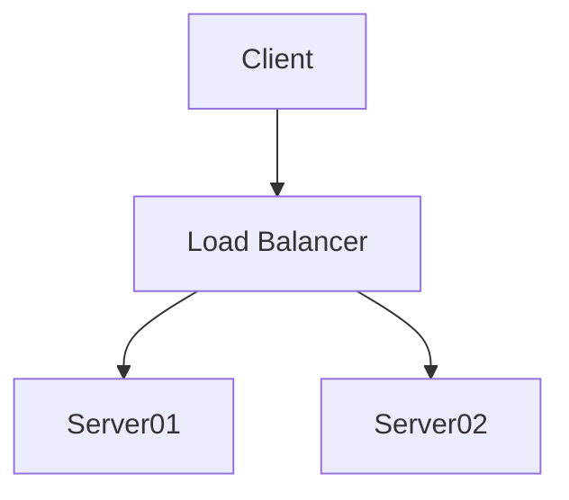
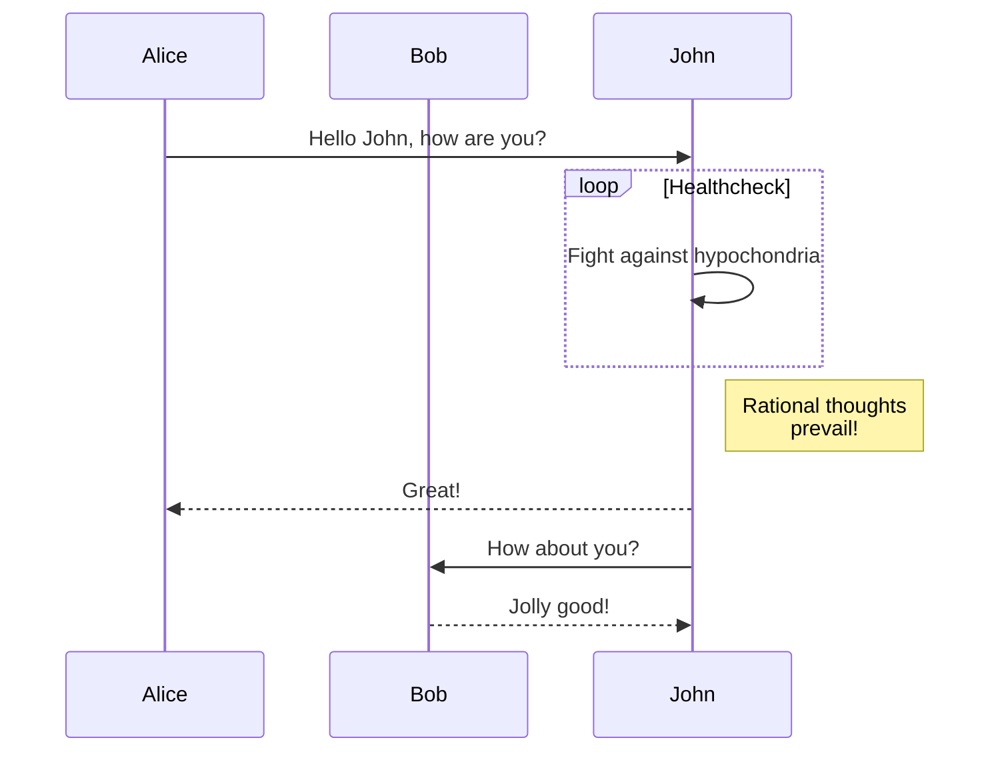
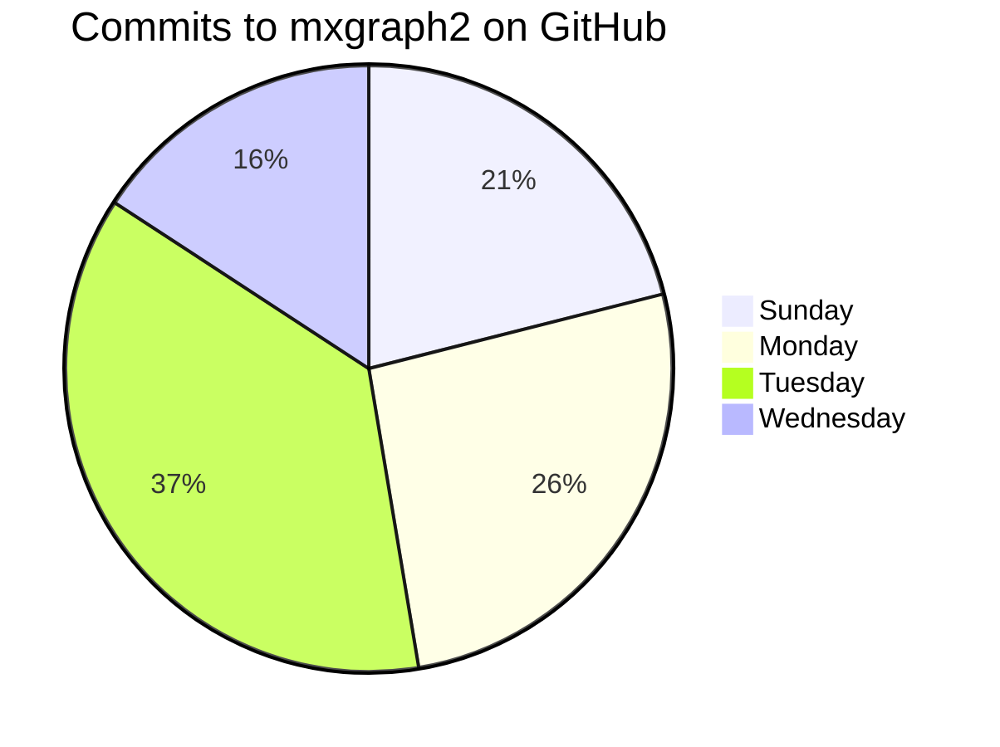

# Arquitetura
## Diagrama

*Acima: Diagrama da Arquitetura*

## Tabela de Funções

Elemento     | Função        | Descrição
:----------- |:-------------:|:-----------:
MySQL        | Center        | Right
DropBox      | Center        | Right
Search engine| Center        | Right

## Grafo

## Grafo 2

## Grafo 3

## Pie Chart using Mermaid

