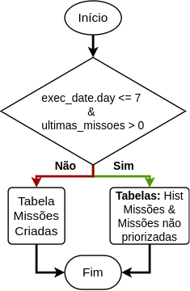

# Filter New Missions
Esta task tem como objetivo filtrar o número de missões em 5 por KPI para cada GT, baseando-se na data em que 
está sendo processado os dados.

## Configurações iniciais
Para a task rodar é necessário que as seguintes importações sejam realizadas:

``` python
from projeto_missoes.util import azuredl, rules
from projeto_missoes.util.dbtools import uuid4_udf, timestamp_udf, uuid4_udf_wconcat_size
from projeto_missoes.util.datetimetools import add_days_udf, file_date_format, file_datetime_format, sub_days, last_sunday, last_weekday_wdiffdays_udf
import projeto_missoes.util.schemas as schemas
from pyspark.sql import functions as F
from pyspark.sql.window import Window
from datetime import datetime, timedelta
from raizenlib.utils.adl import get_adl_client
```
As seguintes variáveis devem ser criadas e o dataframe de missões não priorizadas.

``` python
exec_date = kwargs['execution_date'] + timedelta(days=1)

dias_vencimento = rules.geral.get('dias_vencimento')

missoes_nao_priorizadas = azuredl.fetch_parquet(tab_rev360_nao_priorizadas)
```

A partir das missões não priorizadas são selecioanadas as missões mais recentes:

``` python
 missoes_nao_priorizadas_latest = missoes_nao_priorizadas \
        .filter(F.col('Data_Inicio__c').cast('date') == max_date)
```

Em seguida é trazido e validado, utilizando o método validate_hist_missioes, o histórico de missões do **Sales Force**:

``` python
hist_missoes = azuredl.fetch_parquet(tab_hist_missoes_path)
validate_hist_missioes(hist_missoes_path, main_path, exec_date, hist_missoes)
```
## Tomada de decisões e lógica do processamento

O fluxograma abaixo mostra como é tomada a decisão de quais tabelas de missões serão utilizadas para filtrar novas missões.



### Execução até dia 7 e missões não priorizadas existentes